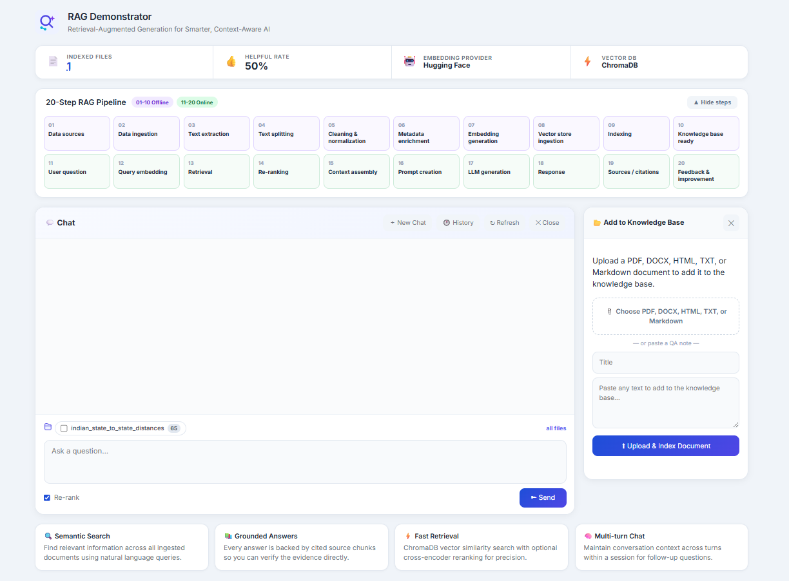

<div align="center">


# RAG Demonstrator

**Retrieval-Augmented Generation for Smarter, Context-Aware AI**

A fully working, end-to-end RAG system that lets you upload any document, ask natural language questions, and receive grounded answers with cited source evidence — all visualized across a live 20-step pipeline.

</div>

---

## Demo

### Project Screenshot



### Demo Video

</video>](https://github.com/user-attachments/assets/1ce63202-f3f2-4d78-9b4c-eea34e1d36e0)

---

## What We Built

Most AI chat tools hallucinate because they rely purely on model memory. We built this demonstrator to show a better approach: **Retrieval-Augmented Generation (RAG)** — where every answer is grounded in documents you provide, with citations pointing back to the exact source chunk.

This project is a complete, runnable RAG system built from scratch with:

- A **Python/FastAPI backend** that handles document ingestion, embedding, vector search, reranking, and LLM generation
- A **Vite/JavaScript frontend** that visualizes every step of the pipeline in real time
- A **persistent vector database** (ChromaDB) that stores your documents as semantic vectors
- **Multi-turn conversation** memory so follow-up questions stay in context
- **Source citations** on every answer so you can verify what the model used

The goal is to make RAG transparent and understandable — not a black box.

---

## Architecture

### System Overview

```
┌─────────────────────────────────────────────────────────────────────┐
│                         OFFLINE PIPELINE (Steps 1–10)               │
│                                                                     │
│  ┌──────────┐   ┌──────────┐   ┌──────────┐   ┌──────────────────┐  │
│  │  Upload  │──▶│ Extract  │──▶│  Chunk   │──▶│  Clean &         │  │
│  │ Document │   │  Text    │   │  Split   │   │  Normalize       │  │
│  │PDF/DOCX/ │   │(pypdf,   │   │(LangChain│   │  (whitespace,    │  │
│  │HTML/TXT/ │   │ docx,    │   │ Recursive│   │   punctuation)   │  │
│  │Markdown) │   │ bs4)     │   │ Splitter)│   │                  │  │
│  └──────────┘   └──────────┘   └──────────┘   └────────┬─────────┘  │
│                                                        │            │
│  ┌──────────────────────────────────────────────────────▼─────────┐ │
│  │              Metadata Enrichment                               │ │
│  │   source · title · file_type · chunk_index · ingested_at       │ │
│  └──────────────────────────────┬──────────────────────────────── ┘ │
│                                 │                                   │
│  ┌──────────────────────────────▼──────────────────────────────── ┐ │
│  │         Embedding Generation (HuggingFace Sentence Transformers│ │
│  │              all-MiniLM-L6-v2  →  384-dim dense vectors        │ │
│  └──────────────────────────────┬──────────────────────────────── ┘ │
│                                 │                                   │
│  ┌──────────────────────────────▼──────────────────────────────── ┐ │
│  │              ChromaDB  (Persistent Vector Store)               │ │
│  │         upsert(ids, documents, embeddings, metadatas)          │ │
│  │              cosine similarity · HNSW index                    │ │
│  └─────────────────────────────────────────────────────────────── ┘ │
└─────────────────────────────────────────────────────────────────────┘

┌─────────────────────────────────────────────────────────────────────┐
│                         ONLINE PIPELINE (Steps 11–20)               │
│                                                                     │
│  ┌──────────┐   ┌──────────┐   ┌──────────┐   ┌──────────────────┐  │
│  │  User    │──▶│  Query   │──▶│ ChromaDB │──▶│  CrossEncoder    │  │
│  │ Question │   │ Embedding│   │ Top-K    │   │  Re-ranking      │  │
│  │          │   │(same     │   │ Retrieval│   │ (optional)       │  │
│  │          │   │ model)   │   │          │   │                  │  │
│  └──────────┘   └──────────┘   └──────────┘   └────────┬─────────┘  │
│                                                        │            │
│  ┌──────────────────────────────────────────────────────▼─────────┐ │
│  │              Context Assembly                                  │ │
│  │   [1] chunk text (source: doc.pdf) · [2] chunk text ...        │ │
│  └──────────────────────────────┬──────────────────────────────── ┘ │
│                                 │                                   │
│  ┌──────────────────────────────▼──────────────────────────────── ┐ │
│  │              Grounded Prompt + OpenAI LLM                      │ │
│  │   System: answer strictly from evidence, cite chunks           │ │
│  │   User:   Evidence: [1]...[2]... Question: ...                 │ │
│  └──────────────────────────────┬──────────────────────────────── ┘ │
│                                 │                                   │
│  ┌──────────────────────────────▼──────────────────────────────── ┐ │
│  │   Response: answer · confidence · latency · cited sources      │ │
│  └──────────────────────────────┬──────────────────────────────── ┘ │
│                                 │                                   │
│  ┌──────────────────────────────▼──────────────────────────────── ┐ │
│  │   Feedback captured → SQLite history · session memory          │ │
│  └─────────────────────────────────────────────────────────────── ┘ │
└─────────────────────────────────────────────────────────────────────┘
```

### Technology Stack

| Layer | Technology | Role |
|---|---|---|
| Frontend | Vite + Vanilla JavaScript | Real-time pipeline visualization, chat UI, document ingestion |
| API | FastAPI + Python 3.11+ | Orchestrates all 20 pipeline steps, REST endpoints |
| Text Extraction | pypdf · python-docx · BeautifulSoup | Parse PDF, DOCX, HTML, TXT, Markdown |
| Chunking | LangChain `RecursiveCharacterTextSplitter` | Overlapping context-preserving chunks |
| Embeddings | HuggingFace `sentence-transformers/all-MiniLM-L6-v2` | Local 384-dim semantic vectors |
| Vector Store | ChromaDB (persistent) | Cosine similarity search with HNSW index |
| Reranking | HuggingFace `cross-encoder/ms-marco-MiniLM-L-6-v2` | Precision scoring of question/chunk pairs |
| LLM | OpenAI Chat Completions (gpt-4o-mini) | Grounded answer generation from evidence only |
| History | SQLite | Persistent query history and multi-turn sessions |

---

## How RAG Works — The 20 Steps

Understanding RAG is the core purpose of this project. Here is what happens end-to-end:

### Offline Phase — Building the Knowledge Base

| Step | Name | What Happens |
|---|---|---|
| 1 | Data Sources | You upload PDF, DOCX, HTML, TXT, or Markdown files |
| 2 | Data Ingestion | File bytes are read and source identity is preserved |
| 3 | Text Extraction | Format-specific parsers extract clean readable text |
| 4 | Text Splitting | LangChain splits text into overlapping chunks (700 chars, 120 overlap) |
| 5 | Cleaning | Whitespace and punctuation are normalized |
| 6 | Metadata Enrichment | Each chunk gets source, title, type, index, and timestamp |
| 7 | Embedding Generation | Each chunk is converted to a 384-dim semantic vector |
| 8 | Vector Store Ingestion | Vectors + text + metadata are upserted into ChromaDB |
| 9 | Indexing | ChromaDB builds a cosine similarity HNSW index |
| 10 | Knowledge Base Ready | The system is ready to answer questions |

### Online Phase — Answering Questions

| Step | Name | What Happens |
|---|---|---|
| 11 | User Question | You type a natural language question |
| 12 | Query Embedding | The question is embedded using the same model as the documents |
| 13 | Retrieval | ChromaDB returns the top-K most semantically similar chunks |
| 14 | Re-ranking | A CrossEncoder scores each chunk against the question for precision |
| 15 | Context Assembly | Top chunks are labeled [1], [2]... and assembled as evidence |
| 16 | Prompt Creation | A grounded system prompt instructs the LLM to cite only from evidence |
| 17 | LLM Generation | OpenAI generates an answer strictly from the provided evidence |
| 18 | Response | Answer, confidence score, provider, and latency are returned |
| 19 | Sources & Citations | The exact source chunks used are shown as numbered evidence |
| 20 | Feedback | You rate the answer helpful/not helpful — stored for improvement |

---

## Key Concepts Explained

**Why RAG instead of just asking ChatGPT?**
A plain LLM answers from training data which may be outdated, wrong, or hallucinated. RAG forces the model to answer only from documents you provide, making answers verifiable and traceable.

**What is a vector embedding?**
A vector embedding converts text into a list of numbers (a vector) that captures semantic meaning. Similar sentences produce similar vectors. This allows searching by meaning rather than exact keywords.

**What is cosine similarity?**
A measure of how similar two vectors are, regardless of their magnitude. A score of 1.0 means identical direction (very similar meaning), 0.0 means unrelated.

**What is reranking?**
Initial retrieval uses fast approximate vector search. Reranking applies a slower but more accurate CrossEncoder model that reads the question and each chunk together to produce a precise relevance score.

**What is grounding?**
Grounding means the LLM is constrained to answer only from the provided evidence chunks. If the answer is not in the evidence, the system returns "This answer is not available in the knowledge base" rather than guessing.

---

## UI Screenshots

> **Note:** Run the application locally and replace these placeholders with actual screenshots.

### Main Chat Interface
```
┌─────────────────────────────────────────────────────────┐
│  [Logo] RAG Demonstrator                                │
│         Retrieval-Augmented Generation for              │
│         Smarter, Context-Aware AI                       │
├──────────┬──────────┬──────────┬──────────┬────────────┤
│ Indexed  │ Helpful  │Embedding │ Vector   │            │
│  Files   │  Rate    │ Provider │   DB     │            │
├─────────────────────────────────────────────────────────┤
│  [▼ 20-Step RAG Pipeline]                               │
│  01 02 03 04 05 06 07 08 09 10 (Offline)                │
│  11 12 13 14 15 16 17 18 19 20 (Online)                 │
├─────────────────────────────────────────────────────────┤
│  💬 Chat                    [+ New] [History] [+ Docs]  │
│ ┌─────────────────────────────────────────────────────┐ │
│ │                   Chat thread                       │ │
│ │  [User bubble]  Your question here                  │ │
│ │  [AI bubble]    Grounded answer with [1][2] cites   │ │
│ │                 ▶ 3 sources                         │ │
│ └─────────────────────────────────────────────────────┘ │
│  [📁 scope bar — filter by file]                        │
│  ┌─────────────────────────────────────────────────┐    │
│  │  Ask a question…                                │    │
│  │                                                 │    │
│  └─────────────────────────────────────────────────┘    │
│  [Re-rank ✓]                          [▶ Send]          │
└─────────────────────────────────────────────────────────┘
```

### Knowledge Base Manager (`/knowledge.html`)
```
┌─────────────────────────────────────────────────────────┐
│  📚 Knowledge Base                                      │
│  Manage ingested documents                              │
├──────────────────────────────┬──────────────────────────┤
│  🔎 Search...                │ [All types ▼] [↻ Refresh]│
├────┬──────────────┬──────────┬──────┬──────────┬───────┤
│ #  │ Title        │ Source   │ Type │ Ingested  │ Del   │
├────┼──────────────┼──────────┼──────┼──────────┼───────┤
│ 1  │ My Document  │ doc.pdf  │ pdf  │ 2024-...  │ [🗑]  │
└────┴──────────────┴──────────┴──────┴──────────┴───────┘
```

---

## Project Structure

```
rag-demo/
├── backend/
│   ├── app/
│   │   └── main.py          # All 20 pipeline steps, FastAPI endpoints
│   ├── data/
│   │   ├── chroma/          # Persistent ChromaDB vector store
│   │   └── history.db       # SQLite query history & sessions
│   ├── .env                 # Environment variables (API keys, config)
│   └── requirements.txt     # Python dependencies
├── frontend/
│   ├── src.js               # Main app — chat, ingest, pipeline visualization
│   ├── knowledge.js         # Knowledge base manager page
│   ├── index.html           # Main page entry point
│   ├── knowledge.html       # Knowledge base page entry point
│   ├── style.css            # All styles
│   └── package.json         # Vite + npm config
├── sample_data/
│   └── checkout_qa_notes.md # Sample document to test with
└── README.md
```

---

## Getting Started

### Prerequisites

- Python 3.11+
- Node.js 18+
- An OpenAI API key (get one at [platform.openai.com](https://platform.openai.com))

### Step 1 — Start the Backend

```bash
cd backend

# Create and activate a virtual environment
python3 -m venv .venv
source .venv/bin/activate        # Windows: .venv\Scripts\activate

# Install dependencies
pip install -r requirements.txt

# Configure environment
# Edit .env and set your OPENAI_API_KEY
# OPENAI_API_KEY=sk-...

# Start the API server
uvicorn app.main:app --reload --port 8000
```

The API is available at `http://localhost:8000`
Interactive API docs at `http://localhost:8000/docs`

> **First run note:** The first embedding or reranking request will download HuggingFace models (~90 MB). This only happens once. To skip reranking during first setup, set `RERANK_ENABLED=false` in `.env`.

### Step 2 — Start the Frontend

```bash
cd frontend
npm install
npm run start
```

Open `http://localhost:5173` in your browser.

### Step 3 — Try It

1. Click **📂 Add Knowledge** in the chat header
2. Upload `sample_data/checkout_qa_notes.md`
3. Watch the 20-step pipeline animate as the document is processed
4. Ask a question like:

   > *What are the highest risks before releasing the checkout change?*

5. The answer will show confidence, latency, and the exact source chunks used

---

## Environment Variables

| Variable | Default | Description |
|---|---|---|
| `OPENAI_API_KEY` | *(required)* | Your OpenAI API key |
| `OPENAI_BASE_URL` | empty | Use any OpenAI-compatible endpoint (e.g. Azure, Ollama) |
| `OPENAI_MODEL` | `gpt-4o-mini` | LLM model for answer generation |
| `EMBEDDING_PROVIDER` | `huggingface` | Embedding provider label |
| `HUGGINGFACE_EMBEDDING_MODEL` | `sentence-transformers/all-MiniLM-L6-v2` | Sentence transformer model |
| `HF_TOKEN` | empty | HuggingFace token for gated models |
| `CHROMA_PERSIST_DIRECTORY` | `./data/chroma` | Where ChromaDB stores vectors on disk |
| `CHROMA_COLLECTION` | `qa_knowledge_base` | ChromaDB collection name |
| `CHUNK_SIZE` | `700` | Target characters per chunk |
| `CHUNK_OVERLAP` | `120` | Overlap between consecutive chunks |
| `TOP_K` | `5` | Number of chunks retrieved per query |
| `RERANK_ENABLED` | `true` | Enable CrossEncoder reranking |
| `SESSION_TURNS` | `6` | Number of prior turns injected into multi-turn context |
| `MIN_CONFIDENCE` | `0.0` | Minimum confidence threshold |
| `FRONTEND_ORIGIN` | `http://localhost:5173` | CORS allowed origin |

---

## API Reference

| Endpoint | Method | Description |
|---|---|---|
| `/api/health` | GET | Backend status, indexed chunk and file counts |
| `/api/steps` | GET | Definitions of all 20 pipeline steps |
| `/api/ingest/text` | POST | Ingest pasted text into the knowledge base |
| `/api/ingest/file` | POST | Ingest an uploaded file (PDF, DOCX, HTML, TXT, MD) |
| `/api/ingest/file/stream` | POST | Ingest with real-time SSE step progress events |
| `/api/query` | POST | Ask a question — retrieves evidence and generates answer |
| `/api/feedback` | POST | Submit helpful / not-helpful rating |
| `/api/documents` | GET | List all ingested documents with chunk counts |
| `/api/documents/{doc_id}` | DELETE | Remove a document and all its chunks |
| `/api/history` | GET | Query history (newest first) |
| `/api/history/{id}` | GET | Single history entry |
| `/api/history/{id}` | DELETE | Delete a history entry |
| `/api/sessions/{id}` | DELETE | Clear multi-turn session memory |
| `/api/metrics` | GET | Aggregate stats — chunks, feedback rate |

---

## Supported File Formats

| Format | Extension | Parser |
|---|---|---|
| PDF | `.pdf` | pypdf |
| Word Document | `.docx` | python-docx |
| HTML | `.html`, `.htm` | BeautifulSoup |
| Plain Text | `.txt` | UTF-8 decode |
| Markdown | `.md` | UTF-8 decode |

---

## Production Considerations

This project is a demonstrator. Before using in production:

| Area | Recommendation |
|---|---|
| Authentication | Add API key or OAuth2 to all endpoints |
| Multi-tenancy | Isolate ChromaDB collections per user/team |
| Feedback storage | Replace in-memory list with a durable database |
| Document versioning | Track document versions and support re-ingestion |
| PII scanning | Scan documents for sensitive data before ingestion |
| Rate limiting | Add per-user rate limits on `/api/query` |
| RAG evaluation | Measure retrieval recall, citation accuracy, and groundedness |
| Ingestion queue | Use a task queue (Celery, ARQ) for large file processing |
| Audit logging | Log all queries, answers, and feedback for compliance |

---

## Troubleshooting

**Backend not starting**
- Ensure Python 3.11+ is installed: `python3 --version`
- Ensure the virtual environment is activated before running `uvicorn`

**`OPENAI_API_KEY` not configured error**
- Open `backend/.env` and set `OPENAI_API_KEY=sk-...`
- Retrieval still works without a key — only LLM generation is disabled

**Model download is slow on first run**
- Set `RERANK_ENABLED=false` in `.env` to skip the CrossEncoder download
- The embedding model (`all-MiniLM-L6-v2`, ~90 MB) downloads once and is cached

**Need to reset the vector store**
- Stop the backend
- Delete `backend/data/chroma/`
- Restart — the collection will be recreated empty

**Frontend shows CORS error**
- Confirm `FRONTEND_ORIGIN=http://localhost:5173` in `backend/.env`
- Confirm the backend is running on port 8000


<div align="center">

Built with FastAPI · ChromaDB · HuggingFace Sentence Transformers · LangChain · OpenAI · Vite

</div>
